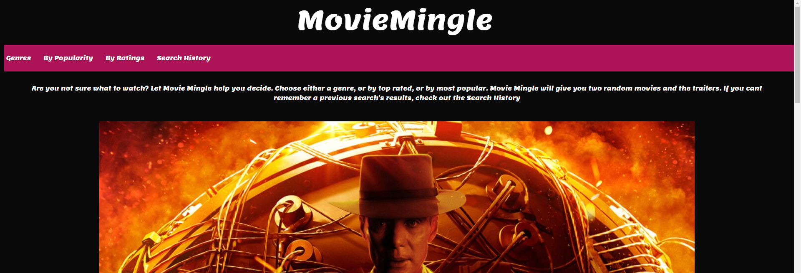
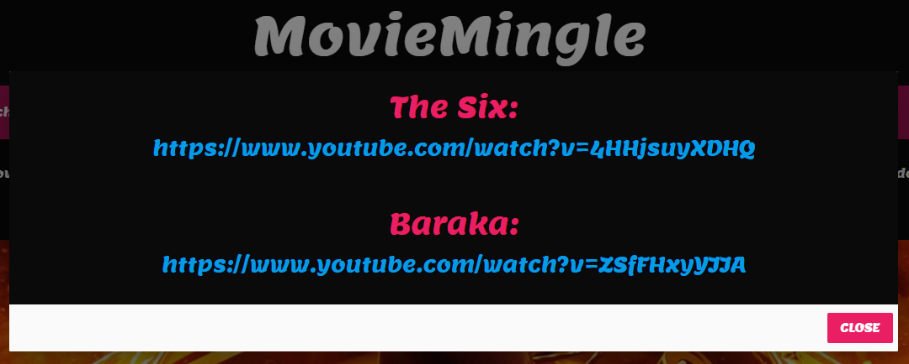
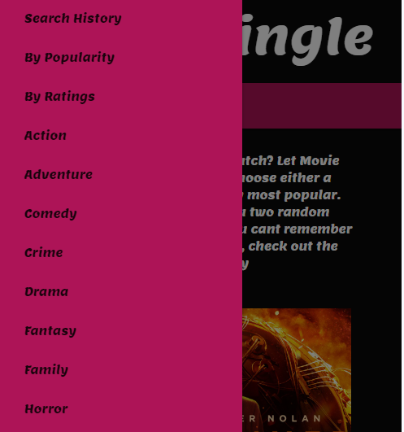
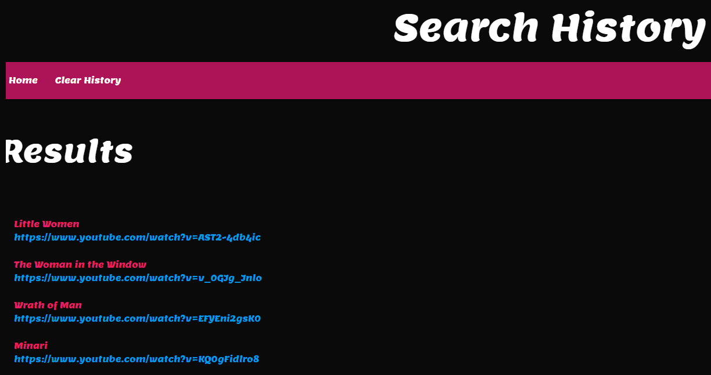

# MovieMingle-Project

## Description
This project was designed to break up the endless scrolling while attempting to find a movie to watch. Attempting to put an end to indecisiveness. Movie Mingle allows a user to select a movie criteria such a specific genre, top rated movies, or most popular, and then this site will present the user with two options, with links to the trailers on youtube.

## Badges

## Visuals

   

## Installation and Usage
Upon visiting the https://matae300.github.io/MovieMingle-Project/, Movie Mingle has a nav bar with A genres pulldown menu, to select a specific movie genre, or by popularity, or by best rated. By choosing any of those options,  a pop up window will appear with two movie titles and a clickable link to youtube for the trailer of the coresponding movie. On smaller devices and mobile, the nav bar links disappear and the burger menu icon appears, when it is clicked the clickable items to get your movie reccomandations pop out from the left side of the screen. By clicking on the search history link, you are redirected to a page that keeps all the movies and their youtube links for the user to look back on their results. By clicking the clear history button, the page and its local history will be cleared.

## Contributing
We are open for outside contribution, as this is started in an educational setting, and there can always be improvments.

## Authors and acknowledgment
Movie Mingle written by:
Matheus Almeida,
Thomas Neylon,
James Ross.

## License
MIT License

## Project status
Under Development
